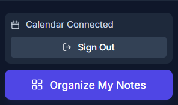
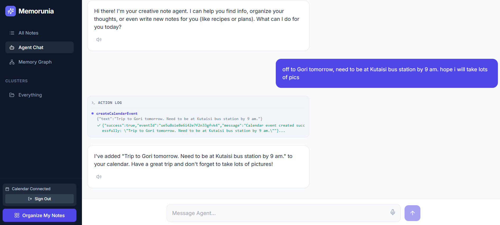
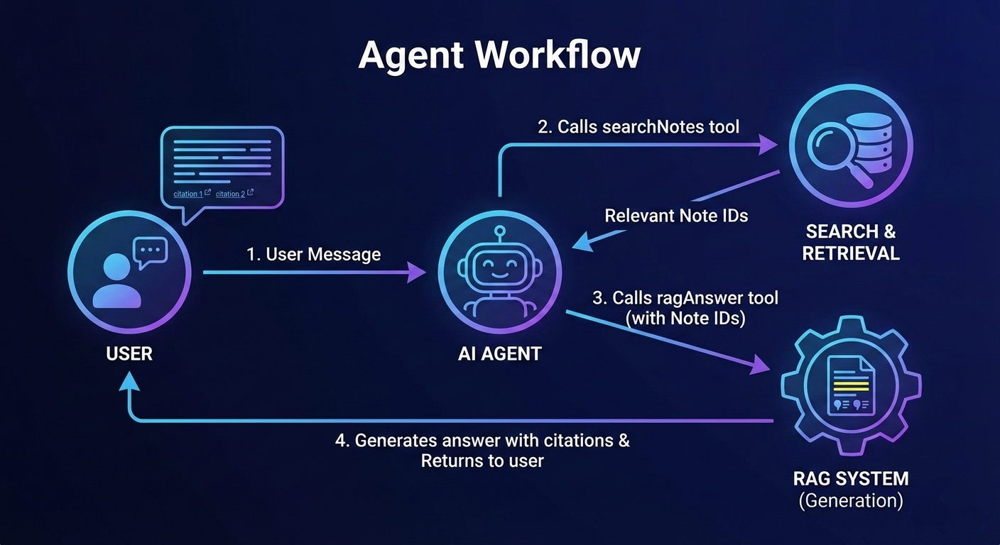

# 🧠 Memorunia
### *AI-Powered Second Brain*
> *Turn your scattered thoughts into a connected Knowledge*

---

## 💡 The Problem: Digital Amnesia

We all suffer from **Digital Amnesia**. We take notes, save snippets, record voice memos, and bookmark articles, but we lose them in the void. Traditional keyword search fails because we forget the *exact words* we used when we wrote that note months ago.

### The Real-World Impact

As someone who uses notes daily, I personally have **over 3,000 unmanaged notes** scattered across different apps and files. Finding information becomes nearly impossible:

- "Where did I save that Rubik's cube algorithm?" → Can't find it because I don't remember the exact notation format
- Notes pile up, become disorganized, and valuable information gets lost forever

**Memorunia** solves this by understanding the *meaning* of your notes, not just matching keywords.

---

## 🚀 The Solution

**Memorunia** is a semantic knowledge base that doesn't just store text, it **understands** it. Using advanced AI and vector embeddings, it creates a second brain that remembers what you meant, not just what you wrote.

### Key Features

1. **Semantic Search**: Ask What was that idea about plants? and it finds the note about Raspberry Pi waterer (no keyword match needed)
2. **Fully Agentic Workflow**: An AI agent that can search, create, update, organize, and answer questions about your notes autonomously
3. **Intelligent Clustering**: Automatically groups related notes together using semantic similarity
4. **Visual Knowledge Graph**: Simply see your notes as an interconnected web using D3.js force-directed graphs
5. **Google Calendar API Integration**: Create calendar events directly from your notes using natural language
6. **Voice-First**: Record thoughts naturally with speech-to-text
7. **File Import**: Upload `.txt` and `.md` files to import existing notes

---

## 🏗️ How We Built It & Why

### Architecture Overview

Memorunia is built as a **client-side application** using React and TypeScript, with all AI processing happening through Google's Gemini API. This ensures privacy (your notes never leave your browser) while leveraging powerful cloud-based AI models.

### Core Technologies & Design Decisions

#### 1. **Semantic Search with Vector Embeddings**


We chose **pure semantic search** for several reasons:

- **Better for Natural Language Queries**: Users think in concepts, not keywords. "Rubik's cube solving patterns" should find notes about "R' D R L' D' L" even without exact keyword matches
- **Handles Synonyms & Context**: "Egg recipe" finds notes about "2 eggs, 2 spoon sugar" because the embedding captures the semantic relationship
- **Scales Better**: With 3000+ notes, keyword search becomes noisy. Semantic search filters by meaning, not just text matching
- **Simpler Architecture**: Pure semantic search is more maintainable and faster for our use case

**Implementation:**
- Uses Google's `text-embedding-004` model to convert notes into 768-dimensional vectors
- Each note's title and content are combined and embedded: `"Title: {title}\nContent: {content}"`
- Search queries are embedded and compared using **cosine similarity**
- Only notes with similarity score > 0.4 are considered "highly relevant"
- Results are filtered to show only truly relevant sources (score > 0.45) to avoid noise

#### 2. **RAG (Retrieval Augmented Generation)**

**How It Works:**
1. User asks a question → Agent uses `searchNotes` tool to find relevant notes via semantic search
2. Relevant notes (with high similarity scores) are retrieved
3. Only notes with score > 0.5 are passed to the RAG system (filters out barely related notes)
4. Gemini generates an answer using only the retrieved context
5. Sources are cited, showing which notes were actually used

**Why This Approach:**
- Ensures answers are grounded in your actual notes (no hallucination)
- Only uses truly relevant context (high similarity threshold)
- Provides transparency with source citations
- Handles complex queries that require multiple notes

#### 3. **Fully Agentic Workflow**

Memorunia implements a **fully autonomous AI agent** using Gemini's function calling capabilities. The agent can:

- **Search** notes semantically
- **Create** new notes with AI-generated content
- **Update** existing notes
- **Delete** notes (with user confirmation)
- **Answer questions** using RAG
- **Organize** notes into semantic clusters
- **Create calendar events** from natural language
- **Summarize** and **rewrite** notes

**Why Agentic?**
- Users can interact naturally: "Create a note about shawarma recipe" → Agent generates content and creates the note
- Multi-step workflows: "Find all notes about eggs and summarize them" → Agent searches, retrieves, and summarizes
- Autonomous organization: "Cluster my notes" → Agent groups related notes semantically
- Reduces cognitive load: Users don't need to manually organize or format

#### 4. **Intelligent Note Clustering**

**How It Works:**
- Uses the same embedding system to calculate similarity between all notes
- Gemini analyzes note content and groups semantically similar notes
- Creates clusters like "Coding Projects", "Recipes", "Study Notes", etc.
- Visualized in the Memory Graph with color-coded groups

**Why It Matters:**
- With many notes, manual organization is impossible
- Automatic clustering reveals hidden connections and its sometimes useful
- Helps discover related notes you forgot about
- Makes the knowledge graph more navigable

#### 5. **D3.js Force-Directed Graph Visualization**

**Why D3.js?**
- **Interactive**: Users can drag nodes, zoom, and explore connections
- **Beautiful**: Force-directed layout creates organic, readable graphs
- **Informative**: Visual representation of note relationships
- **Real-time**: Updates as notes are added or clustered

**Implementation:**
- Notes are nodes, semantic similarity creates edges
- Clusters are visually grouped with colors
- Force simulation creates natural spacing and movement
- Click nodes to open notes

#### 6. **Google Calendar API Integration**






**Why Calendar Integration?**

You might ask: "Why write a note so AI can add it to calendar? Why not just add it directly?"

The answer is **context and workflow**:
- **Natural Language Processing**: "Meeting with John tomorrow at 2pm" → AI understands and creates event
- **From Notes**: "Remember to schedule dentist appointment" in a note → Agent can create the calendar event
- **Voice Input**: Say "Team meeting next Friday" → Note is created, then event is scheduled
- **Agentic Workflow**: The agent can read your notes and proactively suggest calendar events
- **Integration**: Your notes and calendar become part of the same knowledge system

**Implementation:**
- Uses Google Identity Services (new OAuth 2.0) for authentication
- `events.quickAdd` API for natural language event creation
- Seamlessly integrated into the agent's toolset

#### 7. **File Import & Organization**

**Features:**
- Upload `.txt` and `.md` files
- Automatically extracts title (from filename or first line)
- Generates embeddings for imported notes
- Integrates with existing note collection

**Why This Matters:**
- Many users have existing note files
- Bulk import makes migration easy
- Maintains semantic searchability for imported content

---

## 🛠️ Tech Stack

### Frontend
- **React 19** + **TypeScript** - Modern, type-safe UI framework
- **Vite** - Fast build tool and dev server
- **Tailwind CSS** - Utility-first styling
- **D3.js** - Data visualization and force-directed graphs

### AI & Backend Services
- **Google Gemini 2.5 Flash Lite** - Fast, cost-effective AI model for agent reasoning and content generation
- **Google text-embedding-004** - State-of-the-art embedding model for semantic search
- **Google Calendar API** - Event creation and management
- **Google Identity Services** - Modern OAuth 2.0 authentication

### Key Libraries
- **@google/genai** - Gemini API client
- **react-markdown** - Markdown rendering
- **uuid** - Unique ID generation
- **lucide-react** - Icon library

---

## ⚡️ Quick Start Guide

### 1. Prerequisites
- Node.js (v18 or higher)
- A Google Cloud Project with:
  - **Gemini API** enabled
  - **Google Calendar API** enabled (optional, for calendar features)
  - OAuth 2.0 Client ID created (for calendar)

### 2. Installation

```bash
# Install dependencies
npm install

# Create environment file
touch .env
```

### 3. Get Your API Keys 🔑

**Gemini API Key:**
1. Go to [Google AI Studio](https://aistudio.google.com/app/apikey)
2. Click **"Get API key"**
3. Create a new API key
4. Copy the key (starts with `AIza...`)

**Google Calendar Client ID (Optional):**
1. Go to [Google Cloud Console](https://console.cloud.google.com/)
2. Create OAuth 2.0 Client ID (Web application)
3. Add `http://localhost:5173` to **Authorized JavaScript origins**
4. Enable **Google Calendar API**

### 4. Configure Environment

Open `.env` and add:

```env
API_KEY=your_gemini_api_key_here
GOOGLE_CLIENT_ID=your_google_oauth_client_id_here
```

### 5. Run the App

```bash
npm run dev
```

Open `http://localhost:5173` in your browser.

---

## 🎯 Key Technical Decisions

### Why Semantic Search Only?

**We chose pure semantic search** (not hybrid semantic + keyword) because:

1. **Better User Experience**: Users think in concepts. "Rubik's cube patterns" should find "R' D R L' D' L" even without keyword overlap
2. **Handles Scale**: With thousands of notes, keyword search becomes noisy. Semantic search filters by meaning
3. **Natural Language**: Works with conversational queries, not just exact terms
4. **Simpler Architecture**: Pure semantic is easier to maintain and debug

### Why Client-Side?

- **Privacy**: Your notes never leave your browser
- **Speed**: No server round-trips for search
- **Cost**: Embeddings are generated on-demand, not stored on a server
- **Simplicity**: No backend infrastructure needed

### Why Gemini 2.5 Flash Lite?

- **Cost-Effective**: Cheaper than full Flash while maintaining quality
- **Fast**: Low latency for real-time agent interactions
- **Capable**: Handles complex reasoning and function calling
- **Efficient**: Optimized for agent workflows

### Why Agentic Workflow?

Traditional note apps require manual organization. Memorunia's agent:
- **Autonomously organizes** notes into clusters
- **Generates content** when you ask for notes on topics
- **Answers questions** by searching and synthesizing information
- **Proactively helps** by suggesting actions

This is **agentic workflow at its maximum** - the AI doesn't just respond, it acts.

---

## 📊 How It Works: Technical Deep Dive

### 1. Note Creation & Embedding

```typescript
// When a note is created:
const textToEmbed = `Title: ${title}\nContent: ${content}`;
const embedding = await generateEmbedding(textToEmbed);
// Creates a 768-dimensional vector representing the note's meaning
```

### 2. Semantic Search

```typescript
// Search query is embedded
const queryEmb = await generateEmbedding(query);

// Compare with all notes using cosine similarity
const similarity = cosineSimilarity(queryEmb, note.embedding);

// Only return notes with similarity > 0.4 (highly relevant)
```

### 3. RAG Pipeline

```typescript
// 1. Search for relevant notes
const relevantNotes = await searchNotes(query);

// 2. Filter to only high-relevance (score > 0.5)
const highRelevanceNotes = relevantNotes.filter(n => score > 0.5);

// 3. Generate answer using only these notes
const answer = await generateAnswer(query, highRelevanceNotes);
```

### 4. Agent Workflow




```typescript
// Agent receives user message
// → Calls searchNotes tool
// → Receives relevant note IDs
// → Calls ragAnswer tool with note IDs
// → Generates answer with citations
// → Returns to user
```

### 5. Clustering Algorithm

```typescript
// Gemini analyzes all notes
// Groups semantically similar notes
// Returns clusters with note IDs
// Visualized in D3.js graph
```

---


## 🏆 Why Memorunia Stands Out

### 1. **Fully Agentic Workflow**
Unlike traditional note apps, Memorunia's AI agent can:
- Autonomously search, create, update, organize notes using function calling
- Generate content when asked
- Answer complex questions by synthesizing multiple notes
- Proactively suggest actions

### 2. **True Semantic Understanding**
- Not just keyword matching - understands meaning
- Handles synonyms, context, and natural language
- Works with thousands of notes without degradation


### 3. **Real-World Problem Solving**
- Built by someone with 3000+ unmanaged notes
- Solves actual pain points: finding information, organizing content, fully AI integrated experience
- Works with existing note files (import functionality)

### 4. **Beautiful, Intuitive UX**
- Visual knowledge graph makes abstract concepts tangible
- Voice-first input for natural interaction
- Clean, modern interface built with Tailwind CSS

### 5. **Production-Ready Features**
- File upload and import
- Google Calendar API integration
- Source citations with clickable links
- Related notes discovery
- AI-powered note editing


---


This project is built for the **Hack the Halls** GDG kutaisi hackathon

---

##  Acknowledgments

Built with:
- Google Gemini API
- Google Calendar API
- D3.js visualization library
- React and the open-source community

---

**Memorunia** - Because your second brain should remember what you meant, not just what you wrote...
